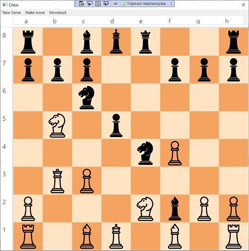
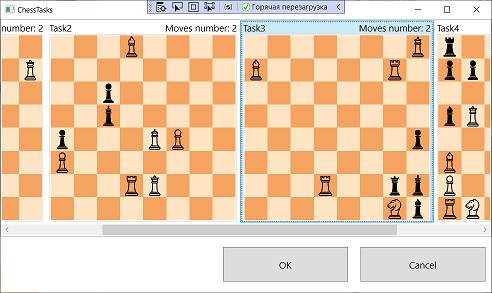

# Курсовой проект по технологиям .NET

### Приложение "Шахматы"

#### Краткое описание проекта:

Одиночная игра c искусственным интеллектом (ИИ).
С ИИ можно будет соревноваться в целых партиях или решать небольшие задачи за ограниченное число ходов.
Есть локальный мультиплеер.

#
___Студент:__ Кутырёв Д.О_:

___Преподаватель:__ Вегнер Я. В._

#

